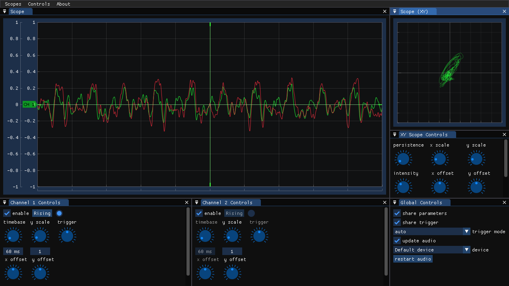

# unscope

Audio oscilloscope for Linux _and Windows?_


## Reporting issues

Please do! Report them in the *Issues* tab.

## Building

### Getting the source

Open a terminal and enter these commands to clone this repository (make sure you have git installed!).
```
git clone https://github.com/Eknous-P/unscope.git --recursive
cd unscope
```

- If you forget to clone recursively, you will have to enter
```
git submodule update --init --recursive
```
to get the submodules.

### Getting the libraries

Currently unscope requires the OpenGL, SDL, ALSA and PulseAudio dev libraries to be installed

#### Ubuntu and Ubuntu-based
```
sudo apt install libasound2-dev libpulse-dev libopengl-dev libxext-dev
```

### Building (Linux build)

```
mkdir build
cd build
cmake ..
make
```

### Building (Windows build, MinGW)
- note: the Windows build is not tested thouroughly!

```
mkdir build
cd build
cmake .. --toolchain ../tc_mingw.cmake
make
cp submodules/SDL/SDL2.dll .
```
